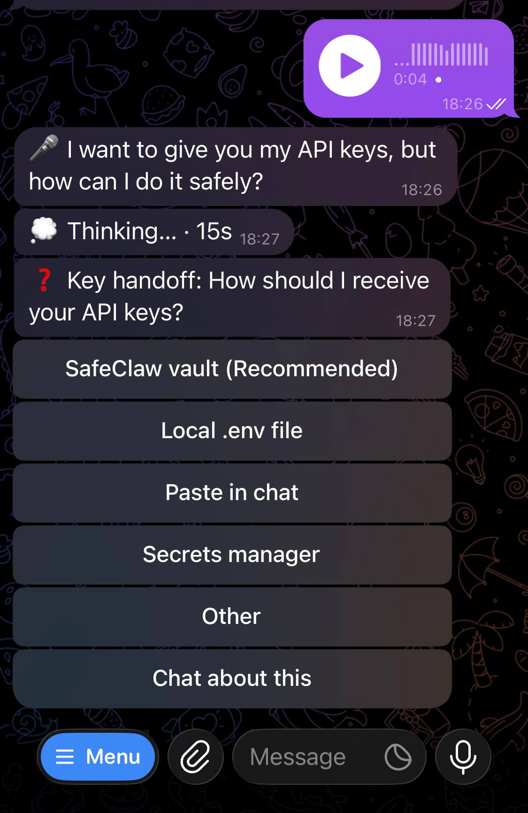

<div align="center">

# tg-claude-bot

**Your local Claude Code, in your pocket.**

A single-file Telegram bridge to the Claude Code CLI: pick up your sessions
from your phone, vibe-code by voice, keep every tool and skill, answer
prompts with buttons.

[](LICENSE)
[](pyproject.toml)
[](https://github.com/anthropics/claude-agent-sdk-python)


[](SECURITY_AUDIT.md)

</div>

---

Messaging the bot is like typing `claude` in a shell: fresh session, same
tools, skills, and config — it *is* your local CLI. `/resume` picks up any
session you left in the terminal. The bot is a thin stateless router; the CLI
owns everything.

## ✨ Highlights

| | |
|---|---|
| 🔁 **Resume any real session** | Inline picker over your actual session store (`~/.claude/projects`), with the CLI's own AI titles; cross-project, cwd auto-detected. |
| 🧵 **Per-topic sessions** | Every forum topic is an independent session — one conversation per `(chat, topic)`. |
| ⏩ **Zero command remapping** | Unknown `/commands` go verbatim to the CLI: `/compact`, skills, anything headless. `/context`-style output is relayed. |
| 🔘 **Buttons instead of a TUI** | Permissions — including the CLI's native *don't-ask-again* option — plan approval, clarifying questions: all inline buttons. Answered prompts clean up after themselves. |
| 💬 **Chat-native ergonomics** | Reply to any message to quote it into context. Mid-turn messages queue with a 👀 reaction and switch to 👨‍💻 while processing — never dropped, never noisy. Multi-forwards and 4096-split long texts arrive as one coherent message. |
| 🎤 **Voice messages** | Local faster-whisper, bilingual zh/en, editable 🎤 transcript. No audio leaves your machine. |
| 🖼 **Native media** | Images ride inside the message as base64 blocks, lifecycle owned by the CLI transcript; other files get a TTL-cleaned media dir. |
| 📟 **Live status** | One `⏳ Working…` message edited in place, morphing into the reply; elapsed ticker for long commands. |
| 🎛 **CLI parity** | `/model`, `/effort`, `/mode` (the shift+tab cycle), `/usage`, `/esc` — options sourced from official APIs and the CLI itself, no hardcoded lists. |
| 🟠 **Context warnings** | 🟠 at 80% / 🔴 at 90% of the real context window, same source as `/context`. |
| ♻️ **Restart-proof** | Topics stay bound to their sessions across restarts — even hard crashes: interrupted turns auto-resume from the transcript, queued messages are replayed. |
| 🔒 **Owner/guest profiles** | Allowlisted chats only; owner full access, guests scoped with Allow/Deny escalation to the owner. |

## 🚀 Quick start

Claude Code is the prerequisite — so let it install its own bridge. Send it
this on the machine that should host the bot:

```
setup https://github.com/xhyumiracle/tg-claude-bot
```

This README is the runbook; it will only ask you for the @BotFather token and
your user id.

### Manual setup

**1. Prerequisites** — [Claude Code CLI](https://docs.anthropic.com/en/docs/claude-code)
installed and logged in, plus [uv](https://docs.astral.sh/uv/).

**2. Create your bot** — [@BotFather](https://t.me/BotFather) → `/newbot` →
copy the token. For groups: disable privacy mode (`/setprivacy`) or make the
bot admin.

**3. Find your user id** — message [@userinfobot](https://t.me/userinfobot).

**4. Install & configure**

```bash
git clone https://github.com/xhyumiracle/tg-claude-bot && cd tg-claude-bot
uv sync                 # add --extra voice for local voice transcription
cp .env.example .env && chmod 600 .env   # fill in TG_BOT_TOKEN and OWNER_USER_ID
```

**5. Run it**

```bash
uv run python bot.py
```

DM your bot `/status` — you're live.

### Run as a service (recommended)

The whole point is being reachable when you're away from the machine, so once
the foreground run works, put it under systemd:

```bash
# edit the YOUR_USER paths in tg-claude-bot.service first
sudo cp tg-claude-bot.service /etc/systemd/system/
sudo systemctl enable --now tg-claude-bot
journalctl -u tg-claude-bot -f          # watch the logs
```

To deploy an update gracefully: `touch ~/.tgclaude/restart-requested` — the bot
restarts as soon as every conversation is idle, so no reply is ever cut off.
Even on a hard crash nothing is lost: topics rebind to their sessions, and
interrupted turns resume with `continue` (the CLI transcript has everything).

### Configuration

All in `.env` (see [.env.example](.env.example)):

| Variable | Purpose |
|---|---|
| `TG_BOT_TOKEN` | Bot token from @BotFather *(required)* |
| `OWNER_USER_ID` | Your numeric Telegram id — full access *(required)* |
| `GUEST_USER_IDS` | Extra user ids, served with the restricted guest profile |
| `TARGET_GROUP_ID` | A group to serve (guest profile; topics = separate sessions) |
| `OWNER_DEFAULT_CWD` | Default working directory for new owner sessions |
| `RESUME_SESSION_ID` | Session to bind the owner's DM to on first contact |
| `GUEST_READ_DIRS` / `GUEST_WRITE_DIRS` | Colon-separated dirs guests may read / write |
| `GUEST_SYSTEM_PROMPT_FILE` | Custom system prompt for the guest profile |
| `WHISPER_MODEL` | faster-whisper model (default `large-v3-turbo`) |
| `TGCLAUDE_MEDIA_TTL_DAYS` | Retention for received files (default 14) |

## ⚖️ How it compares

| | **tg-claude-bot** | tmux-scraping bridges | direct-API bots |
|---|---|---|---|
| Backend | Claude Agent SDK — structured events | live TUI + ANSI scraping | raw Anthropic API |
| Sessions | ✅ resume *any* session in the CLI store, AI titles | ⚠️ only the live pane you attach to | ❌ its own separate history |
| Tools, skills, MCP | ✅ everything the CLI has | ✅ | ❌ reimplemented, if at all |
| Interactive prompts | ✅ native inline buttons — permissions, plan approval, clarifying questions | ⚠️ relayed TUI screen + simulated keypresses | n/a |
| Voice messages | ✅ local whisper, bilingual | ❌ | cloud STT, if any |
| Forum topics = sessions | ✅ one session per topic | ❌ | ❌ |
| Survives bot restarts | ✅ sessions rebind, interrupted turns auto-resume | ⚠️ bridge dies with tmux | ⚠️ needs a database |
| Moving parts | one Python file | tmux + parser + bot | bot + DB + API glue |

Deliberate trade-off: no attaching to a *live* terminal (what tmux bridges
like [ccbot](https://github.com/six-ddc/ccbot) do) — in exchange, structured
events and statelessness.

<p align="center">
  
  <br>
  <em>One turn, end to end: voice → local transcript → live status → clarifying question as buttons.</em>
</p>

## ⌨️ Commands

| Command | What it does |
|---|---|
| `/resume` | Inline session picker (titles, project, age); `/resume <id>` binds directly |
| `/clear` (`/new`) | Start a fresh session in this chat/topic |
| `/status` | Current binding: session, project, model, effort |
| `/model` | Live model picker — real names and context windows from `/v1/models` |
| `/effort` | Reasoning-effort picker — levels discovered from the CLI itself |
| `/mode` | Native permission modes: default · acceptEdits · plan · bypassPermissions |
| `/permissions` | View and revoke the allow rules accumulated by *don't-ask-again* |
| `/export` | Send this session's transcript file |
| `!command` | Bash mode — run a shell command directly in the session's cwd (owner-typed only) |
| `/usage` | Subscription limits (5h / weekly / per-model / credits) |
| `/whisper` | Pick the voice-transcription model |
| `/esc` (`/stop`) | Interrupt the current turn — the CLI's ESC |
| anything else | Forwarded verbatim to the CLI: `/compact`, `/context`, `/cost`, your skills… |

`/` autocompletes in Telegram — the menu is registered via `setMyCommands`.

## 🏗 Architecture

```
Telegram ── python-telegram-bot ── bot.py (stateless router)
                                     │  claude-agent-sdk (one client per chat/topic)
                                     └─ Claude Code CLI ── ~/.claude/projects/*.jsonl
```

Conversation state lives in the CLI's own files; the bot keeps only a tiny
pointer file (`~/.tgclaude/`) — which topic resumes which session, plus what
was mid-flight. Kill the bot — or the power — and topics rebind, interrupted
turns continue automatically.

## 🔒 Security model

- Allowlisted chats only; everything else is ignored.
- All secrets live in `.env` (chmod 600) — never in the systemd unit, which is
  world-readable.
- Owner: full permissions. Guests: scoped read/write and a custom prompt;
  out-of-scope tool calls escalate to the owner as Allow/Deny buttons.
- `!` bash mode is the one deliberate shell surface: owner-typed messages
  only — forwarded text never executes, guests never reach it.
- Session management commands are owner-gated everywhere; so is `/mode` —
  permission modes change the guardrails themselves, and `bypass permissions`
  disables the guest sandbox for that conversation.
- Voice notes are transcribed locally and deleted; images follow the CLI's
  transcript retention.
- Full threat model, verified controls, and accepted risks:
  [SECURITY_AUDIT.md](SECURITY_AUDIT.md) — a line-by-line self-audit by the
  model this bot bridges.

## 🙅 Non-goals

- Attaching to a *live* terminal — see the comparison above.
- Replicating TUI-only dialogs (`/config` etc.); what matters is rebuilt as
  bot commands (`/model`, `/effort`, `/usage`).
- Being a framework. It's one file — read it, fork it, make it yours.

---

<div align="center">

[MIT](LICENSE) · If this put Claude Code in your pocket, a ⭐ helps others find it.

Friends: [LINUX DO](https://linux.do/)

</div>
